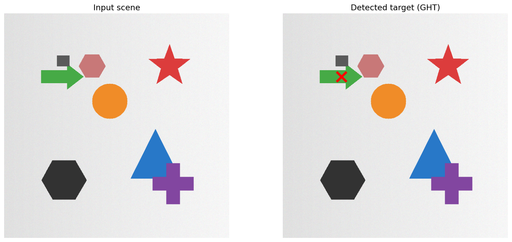
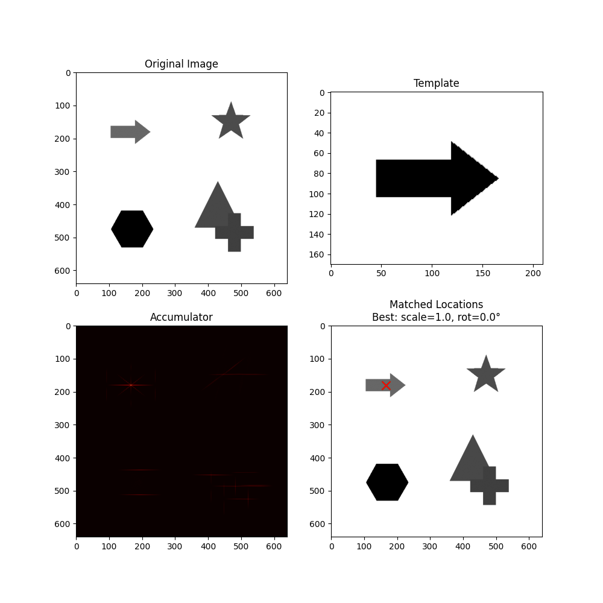
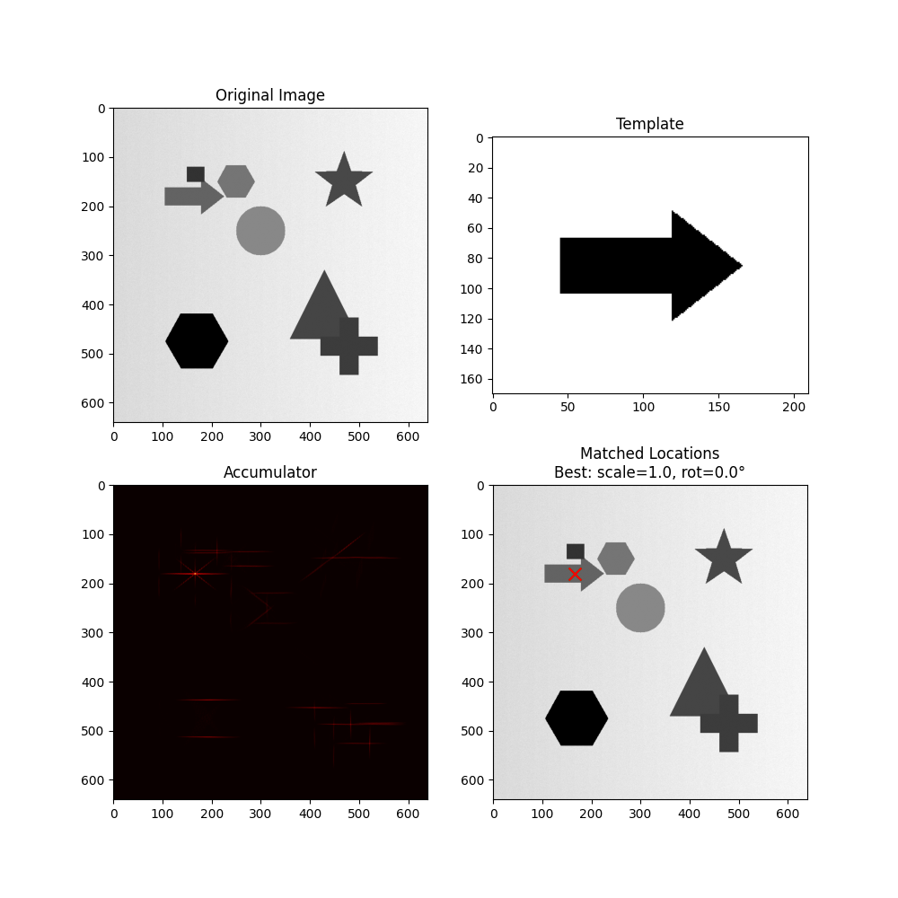
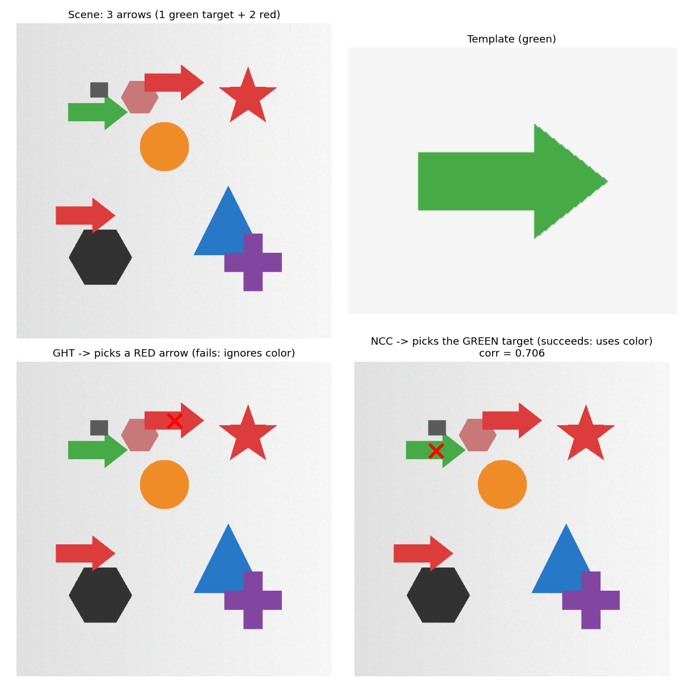

# Generalized Hough Transform

A NumPy-vectorized implementation of the Generalized Hough Transform (GHT) for detecting arbitrary, non-analytical shapes in images, with support for scale and rotation via a 4-D accumulator.




---

## Overview

The standard Hough Transform detects shapes that can be written as an equation, such as lines and circles. The **Generalized Hough Transform** (Ballard, 1981) extends the same voting principle to **arbitrary shapes** described only by a template image. Each edge pixel of the scene votes for the position of the target's reference point, and a peak in the accumulator marks where the object is.

This repository implements the algorithm from scratch in NumPy. Three design choices shape the implementation:

- **Continuous gradient orientations**, computed from the grayscale image with Sobel rather than estimated from the binary edge map, for accurate angular indexing.
- **Vectorized voting** with NumPy broadcasting across pixels, scales, and rotations simultaneously, instead of nested Python loops.
- **Fast convolutions** via `cv2.filter2D` for the Sobel step, preserving zero-padding and cross-correlation semantics.

OpenCV is used only for image I/O, Canny edge detection, and 2-D convolution. The R-Table construction, the 4-D voting, the scale/rotation handling, and the detection logic are all hand-written.

---

## Installation

Requires Python 3.8+.

```bash
git clone https://github.com/<your-username>/generalized-hough-transform.git
cd generalized-hough-transform
pip install -r requirements.txt
```

Dependencies:

```
numpy >= 1.21
opencv-python >= 4.5
matplotlib >= 3.4
```

In headless environments the script detects a non-interactive matplotlib backend and saves the figure without trying to open a display.

---

## Usage

```bash
python3 generalizedHoughTransform.py <scene> <template> [OPTIONS]
```

The script builds the R-Table from the template, votes in the accumulator over the scene, and saves a 2×2 figure (input scene, template, accumulator heat map, detected location) to `output/output.png`. The output directory is created automatically.

### Positional arguments

| Argument | Description |
|---|---|
| `scene` | Image where the object is searched. |
| `template` | Reference image of the object to find. |

### Optional arguments

| Argument | Default | Description |
|---|---|---|
| `--threshold_ratio` | `0.8` | Fraction of the maximum vote required for a location to count as a match. Higher values keep only the most confident matches. |
| `--scales` | `[1.0]` | Explicit list of scale factors, e.g. `--scales 0.8 1.0 1.2`. |
| `--rotations` | `[0.0]` | Explicit list of rotation angles in degrees, e.g. `--rotations 0 90 180 270`. |
| `--scales_range` | — | Three floats `START STOP STEP`; generates scales as `np.arange(START, STOP, STEP)`. Overrides `--scales`. |
| `--rotations_range` | — | Three floats `START STOP STEP`; generates rotations the same way. Overrides `--rotations`. |
| `--canny_low` | `100` | Low threshold for the Canny edge detector. |
| `--canny_high` | `200` | High threshold for the Canny edge detector. |
| `--theta_bin` | `1` | Angular bin size in degrees for gradient-orientation matching. Larger values (e.g. `5`) add angular tolerance and robustness to noise. |

### Scale and rotation search

```bash
python3 generalizedHoughTransform.py scene.png template.png \
  --scales_range 0.8 1.3 0.1 \
  --rotations_range 0 360 5 \
  --theta_bin 5
```

This searches 5 scale factors × 72 rotations — a 4-D accumulator of 360 combinations — and reports the best match together with its scale and rotation.

---

## How it works

The algorithm runs in two phases.

**1. Build the R-Table from the template.** Canny extracts the template's edges, and Sobel computes a continuous gradient orientation `θ` at every edge pixel. The centroid of the edge pixels is used as the reference point. For each edge pixel, the vector from the pixel to the centroid is stored in polar form `(r, α)`, indexed by `θ`. The R-Table maps each gradient orientation to the list of position vectors the template's contour produces for that orientation.

**2. Vote in the accumulator.** For every edge pixel in the scene with orientation `θ`, the R-Table entry for `θ` is looked up; each stored vector `(r, α)` predicts a candidate location for the object's center, and a vote is cast there. Where many scene edges belong to the object, their votes converge on a single accumulator cell — that peak is the detection.

For scale and rotation, the stored vectors are transformed before voting (`r → s·r`, `α → α + φ`) and the accumulator becomes a 4-D volume `(rows × cols × scales × rotations)`. The peak of that volume gives both the position and the matching transformation parameters.

---

## Examples

All three examples below are produced with the same command, changing only the scene file:

```bash
python3 generalizedHoughTransform.py assets/<scene> assets/template.png --theta_bin 3 --threshold_ratio 0.9
```

### 1. Clean scene

Five distinct shapes on a clean background. The target is the green arrow.



The accumulator shows a single sharp peak at the arrow's centroid: **267 votes**, position error of 1 pixel.

### 2. Noisy scene with partial occlusion

Same layout with a textured background, mild noise, nearby distractors, and a small object partially occluding the arrow's tail.



Detection is still pixel-accurate. The peak drops to **160 votes** as some edges of the target are occluded or disturbed, but it remains the maximum of the accumulator. This is the robustness the voting scheme provides: partial occlusion and clutter cost votes, but the distributed nature of the voting absorbs the loss.

### 3. Multiple instances with different appearance

Two additional arrows are added to the scene — same shape and size as the green target, but red.



The GHT picks a red arrow (**208 votes**), more than 200 pixels from the green target. The reason is structural: the GHT votes on **edge geometry only**, so two shapes that are geometrically identical produce identical R-Tables and identical votes — color never enters the computation. For comparison, normalized cross-correlation (`cv2.matchTemplate`), which compares pixel values across all channels, lands directly on the green target (correlation 0.706). This is the canonical case where geometry-only voting is not enough and an appearance-based method is required.

---

## Implementation notes

**Continuous gradients via Sobel on grayscale.** A binary edge map tells you *which* pixels are edges, but an orientation read from it is quantized and noisy. This implementation runs Sobel on the grayscale image and reads the continuous orientation `θ = arctan2(I_y, I_x)` at the Canny-selected pixels: Canny decides *which* pixels are edges, Sobel provides *how they are oriented*.

**Vectorized 4-D voting.** Edge pixels are grouped by quantized orientation; all matching R-Table vectors are fetched at once; scale and rotation are applied as broadcasting operations producing `(scales, vectors)` arrays; candidate centers are computed in a single step; and votes are cast with `np.add.at` as one bulk scatter. This replaces the per-pixel × per-scale × per-rotation loop and is substantially faster.

**Fast convolutions.** Sobel filtering uses `cv2.filter2D` with `BORDER_CONSTANT` padding, preserving cross-correlation semantics, zero padding, and float64 precision while exploiting OpenCV's optimized C implementation.

---

## Limitations

- **Geometry only.** The GHT votes on edge geometry and ignores color, intensity, and texture. Objects of the same shape are indistinguishable to it; discriminating by appearance requires a different method (e.g. template matching, SIFT/ORB).
- **Discrete transformation space.** Scale and rotation are searched on a discrete grid; cost grows multiplicatively with grid resolution.
- **Rotationally symmetric shapes.** Circles and similar shapes have gradients in all directions with no distinctive angular signature and are handled poorly.
- **Rigid template.** The R-Table encodes a rigid shape; non-rigid deformation breaks the geometric consistency of the votes.
- **Edge-detector sensitivity.** Edge density affects both signal and noise in the accumulator, so the Canny thresholds need tuning per domain.

---

## References

- Ballard, D. H. (1981). [Generalizing the Hough Transform to Detect Arbitrary Shapes.](https://doi.org/10.1016/0031-3203(81)90009-1) *Pattern Recognition*, 13(2), 111–122.
- Hough, P. V. C. (1962). *Method and means for recognizing complex patterns.* US Patent 3,069,654.
- Canny, J. (1986). [A Computational Approach to Edge Detection.](https://doi.org/10.1109/TPAMI.1986.4767851) *IEEE TPAMI*, 8(6), 679–698.

---

## License

Released under the [MIT License](LICENSE).
